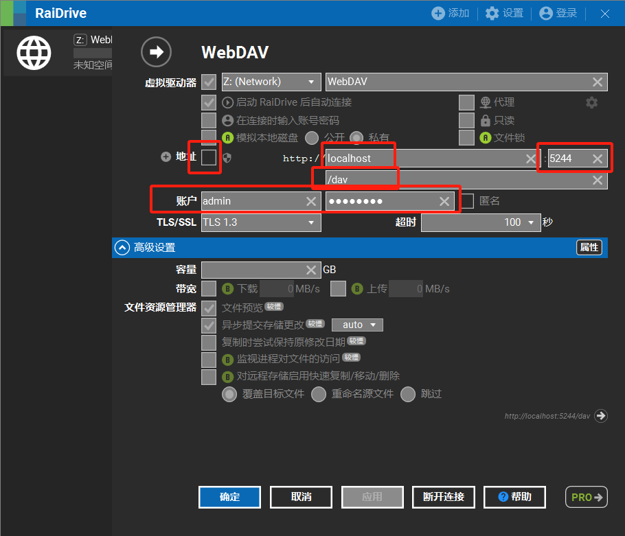
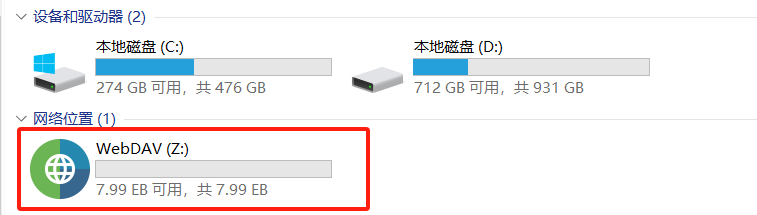

# 搭建无限大小存储服务器
> 参考`https://mp.weixin.qq.com/s/dwv1ePo8pe36QoOl569ejA`
## 安装网盘管理`Alist`
> https://github.com/alist-org/alist/blob/main/README_cn.md
```shell
# 1、拉取alist镜像
docker pull xhofe/alist:latest
# 2、docker安装alist
docker run -d --name alist -v D:/data/alist:/opt/alist/data -p 5244:5244 -e UMASK=022 xhofe/alist:latest
# 3|手动设置一个密码,`NEW_PASSWORD`是指你需要设置的密码
docker exec -it alist ./alist admin set [password]
# 4、访问alist
http://localhost:5244
```

## 安装本地网络驱动器映射`raidrive`
### 1、下载&安装 `https://www.raidrive.com`
RaiDrive_2023.9.90_x64.msi
  https://app.raidrive.com/download/raidrive/release/RaiDrive_2023.9.90_x64.msi
### 2、点击上方的`添加`按钮，按照下图展示输入，其中账号密码为上面的`alist`的登录用户和密码

### 3、查看


## 访问
http://localhost/bd/  访问不成功  TODO

> `test.md`内容为：
```txt
test test test
test test test test
test test test test test
```
> 将`test.md`文件放到挂在盘的`bd`目录下

http://localhost/bd/test.md  能够访问目录下的文件